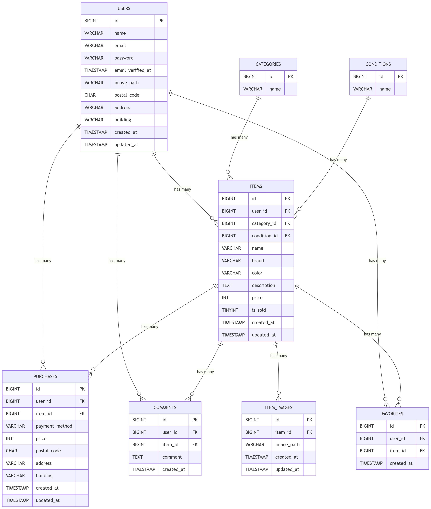

# アプリケーション名
フリマアプリ（Laravel × Docker）

## 概要
ユーザーが会員登録し、メール認証を行った上で  
プロフィール設定・商品出品・商品購入ができる Web アプリケーションです。

Laravel Fortify による認証、Mailhog を用いたメール認証、  
プロフィール画像アップロード、初回ログイン時のプロフィール強制など、  
実践的な機能を備えています。

---

## 環境構築

### 1. リポジトリのクローン
https://github.com/Kiichi-funatu/simulation.git

### 2. Dockerビルド
docker-compose up -d --build

### 3. Laravel環境構築
docker-compose exec php bash
composer install
cp .env.example .env

.env の環境変数を適宜変更  
DB_CONNECTION=mysql
DB_HOST=mysql
DB_PORT=3306
DB_DATABASE=laravel_db
DB_USERNAME=laravel_user
DB_PASSWORD=laravel_pass

### メール設定（Mailhog 使用）

MAIL_MAILER=smtp
MAIL_HOST=mailhog
MAIL_PORT=1025
MAIL_USERNAME=null
MAIL_PASSWORD=null
MAIL_ENCRYPTION=null

MAIL_FROM_ADDRESS=example@example.com
MAIL_FROM_NAME="Simulation App"

### Stripe 設定（決済機能を使用する場合）

STRIPE_SECRET=
STRIPE_KEY=

### 4. アプリケーションキー生成
php artisan key:generate

### 5. マイグレーション実行
php artisan migrate --seed

### 6. ストレージリンク作成（プロフィール画像用）
php artisan storage:link

---

## 使用技術（実行環境）
- PHP 8.x
- Laravel 8.83.x
- MySQL 8
- nginx
- Docker / docker-compose
- Laravel Fortify（認証）
- Mailhog（メール送信テスト）

---

## ER図

---

## 画面 URL 一覧

### ■ 認証（Laravel Fortify）
- ユーザー登録：`http://localhost/register`
- ログイン：`http://localhost/login`
- ログアウト：`http://localhost/logout`
- メール認証誘導画面：`http://localhost/email/verify`
- 認証メール再送：`http://localhost/email/verification-notification`

### ■ プロフィール機能
- プロフィール設定：`http://localhost/mypage/profile`
- マイページ：`http://localhost/mypage`

### ■ 商品機能
- 商品一覧：`http://localhost/`
- 商品詳細：`http://localhost/item/{id}`
- 商品出品：`http://localhost/item/create`
- 商品購入：`http://localhost/purchase/{id}`

---

## メール認証（Mailhog）
- Mailhog：`http://localhost:8025/`
- 認証メールの確認・リンククリックが可能

---

## データベース（操作・確認）
- phpMyAdmin：`http://localhost:8080/`